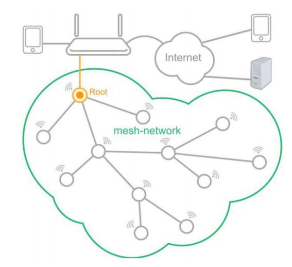
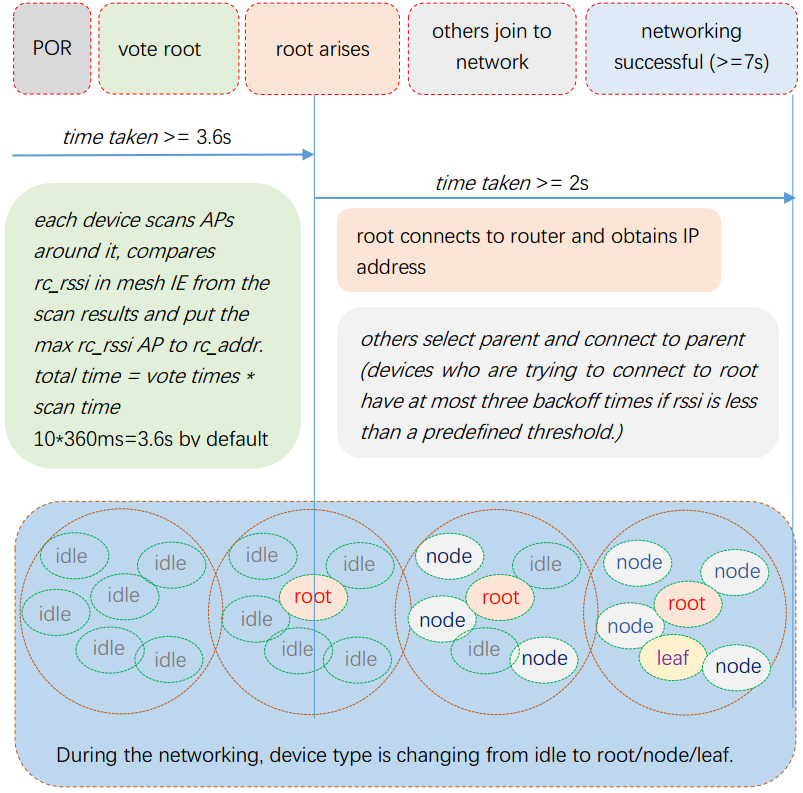

ESP32 MESH
=============

Overview
----------
The development of the Internet of Things (IoT) requires an increasing number of nodes to connect to the internet. However, only a limited number of nodes (usually around 10) can connect to the same router directly. There are two solutions currently available to this problem.
- Super router: The higher the capacity of the router is, the more nodes it allows to connect to it directly.
- ESP32 Mesh network: The nodes can establish a network together and forward packets.

The super router solution applies the star topology, as shown in the figure below. In this configuration, as the hub of the entire network, the router must have a better performance and, therefore, a higher limit to the number of potential connections, so that a larger number of nodes can connect to it. However, only enterprise-grade routers, which are fairly expensive, can achieve such a performance. However, it should also be highlighted that once an enterprise-grade router fails, the entire network built around it will also collapse.

By comparison, the esp32 mesh network solution applies tree or network topologies, as shown in the figure below. The nodes in this configuration can process data as well as forward packets, thus enabling multi-hop forwarding. Meanwhile, the mesh network is able to support self-healing and self-correction. In this way, the affected nodes are able to re-join the network, once they are repaired, and enable a more robust and reliable architecture. On the other hand, the esp32 mesh solution does not need high-performance routers, and can be supported well by consumer-grade routers. Therefore, compared to the super router solution, the esp32 mesh solution is a robust and low-cost choice.

    ESP32 mesh topology

ESP32 Mesh Network
---------------------------------
- In the ESP32 Mesh Network solution, a large number of nodes can connect to the network without having to upgrade the current routers or modify the current configuration.
- The ESP32 Mesh Network solution is supported by tree-based multi-hop networks. In the current configuration, each node works in STA+SoftAP mode.
- ESP32 Mesh Network is implemented at the Data Link layer.

ESP32 Mesh ad hoc network
+++++++++++++++++++++++++++

    ESP32 mesh establishing

Topological structure
++++++++++++++++++++++++++

 ::

                               ------
                              | root |
                               ------
                                 |
               -------------------------------------------
               |             |             |              |
             ------       ------         ------         ------
            | node |     | node |       | node |       | node |       
             ------       ------         ------         ------
               |                           |
      -----------------                ----------
     |        |        |              |          |         ...
   ------   ------   ------         ------     ------
  | node | | node | | node |       | node |   | node |     
   ------   ------   ------         ------     ------
                                      |         
                                 -----------  
                                |           |  
             ....             ------     ------       ....
                             | leaf |   | leaf | 
                              ------     ------   

Data trans
+++++++++++

 ::

                     node                   node                          root                  router/external
                 --------------         --------------         --------------------------         ---------
                | /|\      |   |       | /|\      |   |       | /|\                 |    |       |         |
   Application  |  |      \|/  |       |  |      \|/  |       |  |                 \|/   |       |         |
                 --------------         --------------         --------------------------        |         |
                |     mesh     |       |     mesh     |       |     mesh     |    tcp    |       |         |
   mesh/tcpip   |  <-forward-> |       |  <-forward-> |       |  <-forward-> |    /ip    |       |         |
                 --------------         --------------         --------------------------        |         |
                | /|\       |  |       | /|\       |  |       | /|\       |  | /|\    |  |       |         |
      mac       |  |       \|/ |       |  |       \|/ |       |  |       \|/ |  |    \|/ |       |         |
  dev  --------------------------------------------------------------------------------------------------------

Mesh Frame
++++++++++++++++++

- Refer to `Send Mesh Data`_
- Frame format

 ::

  +--------------+-------------+------------------------------------------+
  |Ethernet Head | Mesh Header |   User Data                              |
  +--------------+-------------+------------------------------------------+

  A mesh packet include mesh header and user data is limited under 1500 byte. 

- Mesh header

 ::

  +---------+------------------------------------------------------------------+
  | byte/bit| 0 1 2 3 4 5 6 7 0 1 2 3 4 5 6 7 0 1 2 3 4 5 6 7 0 1 2 3 4 5 6 7  |
  +=========+========+=======+===============+=================================+
  |   0-3   | ver    |flag   | header lenth  |   totle lenth                   |
  +---------+--------+-----+-+-----+---+-----+-----+-+-+-----------------------+
  |   4-7   |flow(xreq/rsp)|  TTL  |tos| protocol  |p|m|  (reserved)           |
  +---------+--------------+-------+---+-----------+-+-+-----------------------+
  |   8-11  |                                                                  |
  +---------+  destination addr              +---------------------------------+
  |  12-15  |                                |                                 |
  +---------+--------------------------------+    source address               +
  |  16-19  |                                                                  |
  +---------+--------+---------------------------------------------------------+
  |  20-23  |  frag  |         seq                                             |
  +---------+--------+---------------------------------------------------------+
  |  24-27  |                 xseqno                                           |
  +---------+------------------------------------------------------------------+
  | 28-more |                         options                                  |
  +---------+------------------------------------------------------------------+

  Mesh header has fixed 28 byte and variable lenth with options.
  Mesh header lenth is four bytes alignment.

- options:
 
 ::

  +-------------+-----------------+--------------------------------+
  | type:1 byte |   len: 2 byte   | value: len bytes               |
  +-------------+-----------------+--------------------------------+

ESP32 Mesh Throughput
++++++++++++++++++++++++

ESP32 Mesh Event Description
------------------------------------

MESH_EVENT_NO_AP_FOUND
++++++++++++++++++++++++++++++++++++
If a mesh node didn't find any ap or router that could be connected after 32 times scan, this event will arise. It tells application that this node can't join mesh network and application could check mesh configurations or re-set it.

MESH_EVENT_CONNECTED
++++++++++++++++++++++++++++++++++++
If esp32 mesh already started and the mesh device successfully connects to a parent mesh node, the connection event will arise. The event means that mesh network is ready and the application can begin sending or receiveing packets. Application should enable tcpip_adapter and dhcp when this device is root if application want to transfer data with external network.

MESH_EVENT_DISCONNECTED
++++++++++++++++++++++++++++++++++++
Device is disconnected with parent.  Upon receiving this event, the mesh task will stop send packets and flush send queue.

MESH_EVENT_LAYER_CHANGE
++++++++++++++++++++++++++++++++++++
Layer information is changed.

MESH_EVENT_ROOT_GOT_IP
++++++++++++++++++++++++++++++++++++
This event arises when the DHCP client successfully gets the IP address from the DHCP server. The event means that application can creat socket and start transfer data with external network using TCP/IP. 

MESH_EVENT_VOTE_START
++++++++++++++++++++++++++++++++++++
This event can be generated in the following scenarios:
 
 - esp_mesh_waive_root() returns ESP_OK and the mesh node received the ROOT_WAIVE management packet.
 - Selecting a new root.

MESH_EVENT_VOTE_DONE
++++++++++++++++++++++++++++++++++++
mesh vote is done

MESH_EVENT_ROOT_SWITCH_REQ
++++++++++++++++++++++++++++++++++++
root switch request

MESH_EVENT_ROOT_SWITCH_ACK
++++++++++++++++++++++++++++++++++++
root switch acknowledgment

MESH_EVENT_TODS_REACHABLE
++++++++++++++++++++++++++++++++++++
remote IP　address is reached

MESH_EVENT_TODS_UNREACHABLE
++++++++++++++++++++++++++++++++++++
remote IP　address is unreachable

SYSTEM_EVENT_WIFI_READY
++++++++++++++++++++++++++++++++++++
The Wi-Fi driver will never generate this event, which, as a result, can be ignored by the application event callback. This event may be removed in future releases.

SYSTEM_EVENT_SCAN_DONE
++++++++++++++++++++++++++++++++++++
The scan-done event is triggered by esp_wifi_scan_start() and will arise in the following scenarios:

  - The scan is completed, e.g., the target AP is found successfully, or all channels have been scanned.
  - The scan is stopped by esp_wifi_scan_stop().
  - The esp_wifi_scan_start() is called before the scan is completed. A new scan will override the current scan and a scan-done event will be generated.  

The scan-done event will not arise in the following scenarios:

  - It is a blocked scan.
  - The scan is caused by esp_wifi_connect().

Upon receiving this event, the event task does nothing. The application event callback needs to call esp_wifi_scan_get_ap_num() and esp_wifi_scan_get_ap_records() to fetch the scanned AP list and trigger the Wi-Fi driver to free the internal memory which is allocated during the scan **(do not forget to do this)**! 
Refer to 'ESP32 Wi-Fi Scan' for a more detailed description.

Start a ESP32 Mesh Application
--------------------------------
- Make sure you have start wifi and turn wifi mode to APSTA (`wifi guide`_)
- You should call functions: esp_mesh_init() and esp_mesh_set_config() then call esp_mesh_start() to make mesh started.
- Mesh node will auto connect to a mesh network then you can call esp_mesh_send() and esp_mesh_recv() or esp_mesh_recv_toDS() to transfer data.
- More settings and infomations Refer to Mesh APIs and mesh example

ESP32 Mesh Configuration
++++++++++++++++++++++++++
 ::

  +------------------+--------------------------------------------------------------+
  | Field            | Description                                                  |    
  +==================+==============================================================+
  | event_cb         | Mesh event callback defined by user.                         |
  |                  | Application can receive mesh event.                          |    
  |                  |                                                              | 
  +------------------+--------------------------------------------------------------+
  | mesh_id          | Mesh network ID :                                            |
  |                  | Only the same mesh_id will be in same mesh network           |    
  |                  |                                                              |    
  +------------------+--------------------------------------------------------------+
  | router           | Router configurations :                                      |
  |                  | Set router configurations.                                   |
  |                  | Including ssid,password,channel,bssid etc.                   |    
  |                  |                                                              |    
  +------------------+--------------------------------------------------------------+
  | map config       | Map configurations :                                         |
  |                  | Set password and max connection of mesh AP.                  |     
  |                  |                                                              |    
  +------------------+--------------------------------------------------------------+

.. _mesh example: ../../examples/mesh
.. _wifi guide: ./wifi.rst

Send Mesh Data
++++++++++++++++

Call esp_mesh_send() to send ESP32 mesh data. 

Receiving Mesh Data
++++++++++++++++++++++

Call esp_mesh_recv() to receive ESP32 mesh data for myself and esp_mesh_recv_toDS() (in root) to receive ESP32 mesh data for external network.

